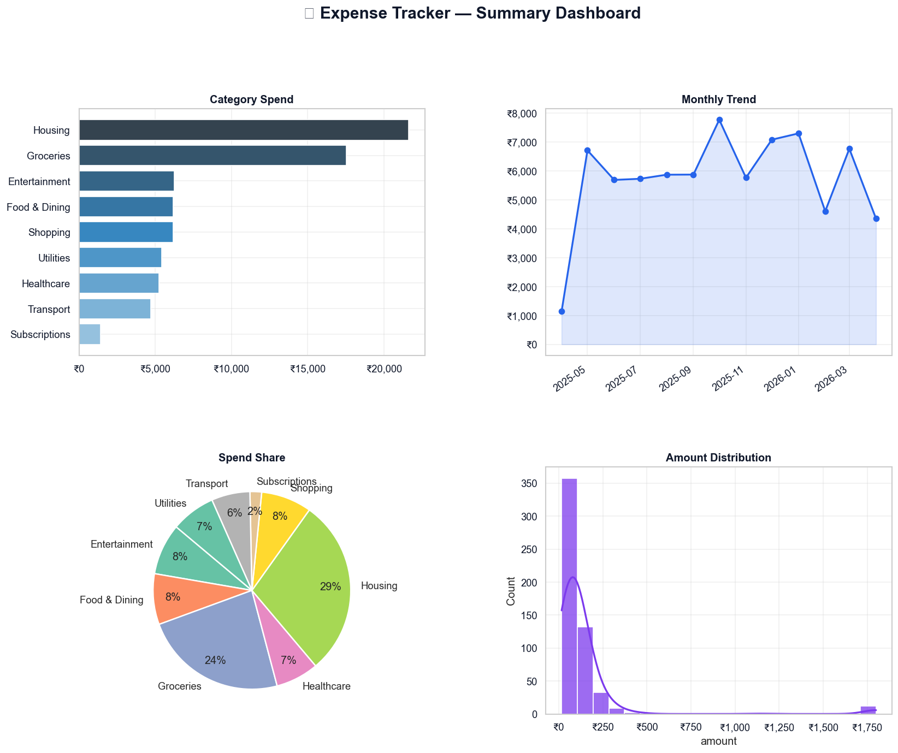

# 💎 AuraFi: Autonomous Wealth & Expense Intelligence Ecosystem

**AuraFi** is a high-performance FinTech intelligence platform that moves beyond basic expense tracking into **Autonomous Financial Wellness**. It combines a robust 9-phase Data Science pipeline with a Multi-Agent AI architecture to detect anomalies, forecast cash flow, and prevent "debt traps" in real-time.

---

## 🚀 Core Intelligence: The Multi-Agent System

AuraFi operates using an ensemble of autonomous agents, each specializing in a critical financial domain:

| Agent | Module | Intelligence Primary Task |
| :--- | :--- | :--- |
| **Aura-Watch** | Anomaly AI | Isolation Forest-based detection of fraudulent or unusual transactions. |
| **Aura-Brain** | Forecaster AI | Time-series projection of end-of-month liquidity and spending velocity. |
| **Aura-Wellness**| Health AI | Proprietary scoring (0-100) for spending behavior and debt-trap prevention. |
| **Aura-Action** | Prescriptive AI | Generating autonomous recommendations (e.g., auto-sweep, budget reallocation). |
| **Aura-Green** | ESG AI | Mapping transaction categories to real-world carbon footprint (kg CO₂). |

---

## 🛠️ The 9-Phase Data Science Pipeline

This project demonstrates a complete, end-to-end industrial Data Science workflow:

1.  **Phase 1: Setup** — Automated environment validation & folder provisioning.
2.  **Phase 2: Ingestion** — Synthetic engine generating 12+ months of non-linear financial history.
3.  **Phase 3: Cleaning** — Robust cleaning (src.cleaner) with null imputation and date normalization.
4.  **Phase 4: EDA** — Exploratory Data Analysis covering distributions, variance, and outliers.
5.  **Phase 5: Feature Engineering** — Calculating Z-scores, rolling averages, and spending tiers.
6.  **Phase 6: Statistics** — Aggregated trends, MoM growth, and category density analysis.
7.  **Phase 7: Visualization** — Generation of 10+ professional charts (Matplotlib/Seaborn).
8.  **Phase 8: Insights Agent** — Rule-based and ML-driven automated financial reporting.
9.  **Phase 9: Export** — Production-ready CSV exports and dashboard-ready artifacts.

---

## 🎨 Visual Intelligence Gallery

The system automatically generates high-fidelity visualizations. View the full gallery in the `outputs/` directory.

*Example: The Holistic Financial Intelligence Dashboard*

---

## 🏆 Industry Relevance
AuraFi replicates advanced features found in leading FinTech platforms:
- **CRED/Mint Style**: Personalized insights and spending velocity.
- **Razorpay/Stripe Style**: Anomaly detection and fraud risk scoring.
- **Revolut Style**: ESG tracking and subscription management.

---

Designed with ❤️ for High-Performance Financial Intelligence.
